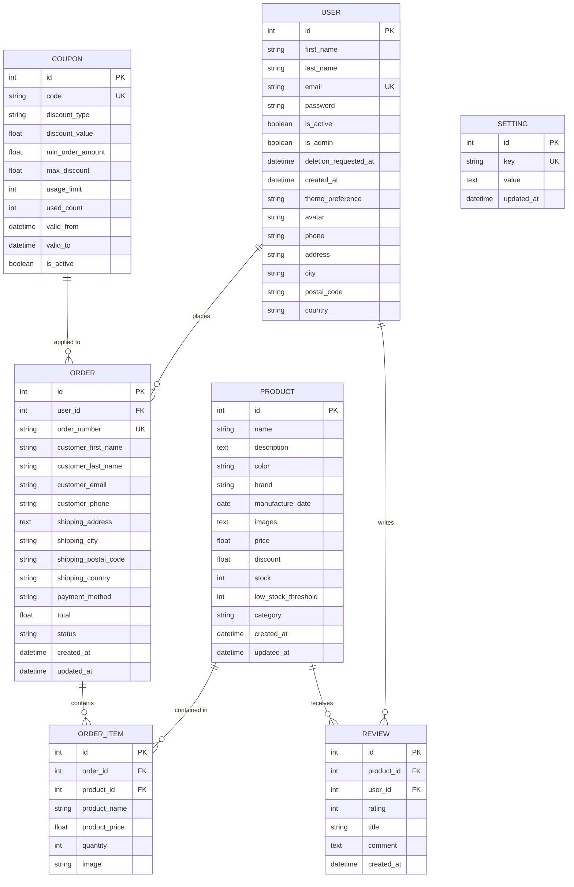

# Database Schema & Relationships

## Overview

This document provides a visual representation of the database schema and relationships for the Electro project.

## Entity Relationship Diagram (ERD)

## Table Descriptions

### User
Stores user account information for both regular customers and administrators.
- **Primary Key:** `id`
- **Unique Constraints:** `email`
- **Relationships:** 
  - One-to-Many with Order (places orders)
  - One-to-Many with Review (writes reviews)

### Product
Stores product inventory and details.
- **Primary Key:** `id`
- **Relationships:**
  - One-to-Many with OrderItem (items in orders)
  - One-to-Many with Review (product reviews)

### Order
Stores customer orders with shipping and payment details.
- **Primary Key:** `id`
- **Unique Constraints:** `order_number`
- **Foreign Keys:** `user_id` (nullable - allows guest orders)
- **Relationships:**
  - Many-to-One with User (belongs to customer)
  - One-to-Many with OrderItem (contains multiple items)

### OrderItem
Junction table linking Orders and Products (line items in an order).
- **Primary Key:** `id`
- **Foreign Keys:** 
  - `order_id` (references Order)
  - `product_id` (references Product)
- **Relationships:**
  - Many-to-One with Order
  - Many-to-One with Product

### Review
Stores product reviews and ratings from users.
- **Primary Key:** `id`
- **Foreign Keys:**
  - `product_id` (references Product)
  - `user_id` (references User)
- **Relationships:**
  - Many-to-One with Product
  - Many-to-One with User

### Setting
Configuration key-value pairs for application settings.
- **Primary Key:** `id`
- **Unique Constraints:** `key`
- **No Relationships:** Standalone configuration table

### Coupon
Discount coupons that can be applied to orders.
- **Primary Key:** `id`
- **Unique Constraints:** `code`
- **No Direct Relationships:** Referenced programmatically in orders

## Key Relationships

| Relationship | Type | Details |
|---|---|---|
| User → Order | 1-to-Many | User can place multiple orders (nullable user_id allows guest checkout) |
| User → Review | 1-to-Many | User can write multiple product reviews |
| Product → OrderItem | 1-to-Many | Product can appear in multiple orders |
| Product → Review | 1-to-Many | Product can have multiple reviews (with cascade delete) |
| Order → OrderItem | 1-to-Many | Order contains multiple line items |

## Cascade Behaviors

- **Review → Product:** Delete on Product deletion (cascade='all, delete-orphan')
- **OrderItem:** Foreign key constraints on both Order and Product

## Notes

- **Guest Orders:** Orders can exist without a user (user_id is nullable) for guest checkout functionality
- **Product Snapshots:** OrderItem stores product name and price at order time to maintain historical record
- **Stock Management:** Product includes `low_stock_threshold` for inventory alerts
- **Soft Deletes:** User has `deletion_requested_at` for soft delete capability
- **Timestamps:** Most tables include `created_at` and/or `updated_at` for audit trails

## Database Visualization
 - *Visit:* https://dbdiagram.io/d/GadsandGets-6a0ea215dfb20dafcdb99a10